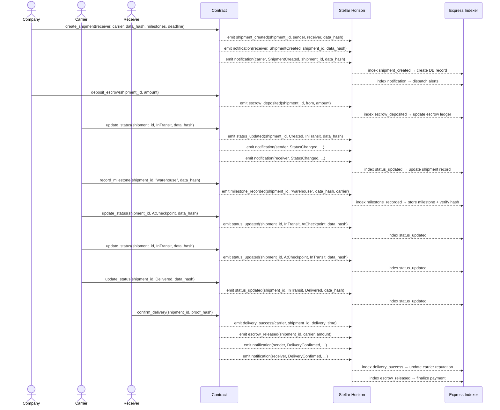
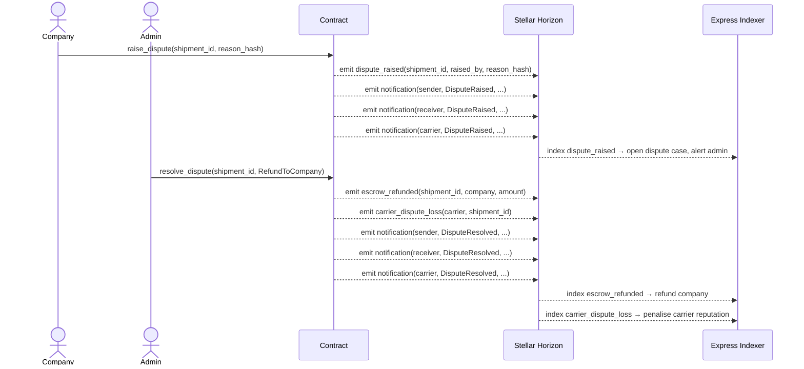
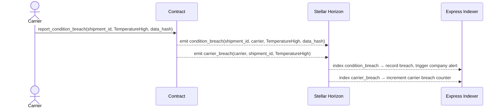
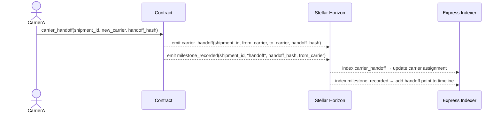
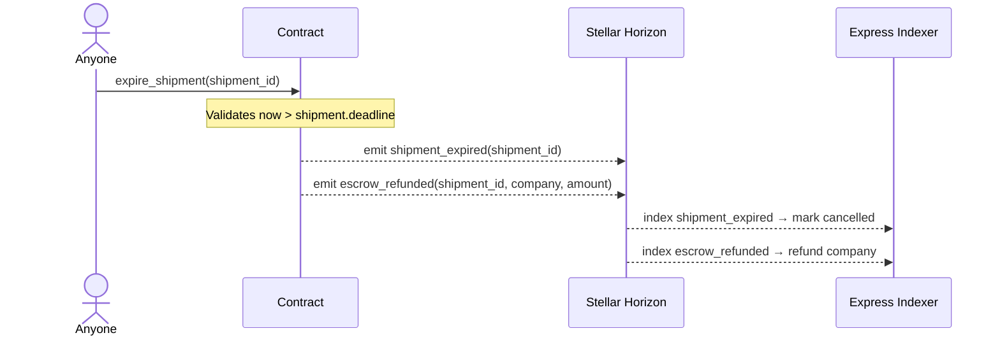

# Shipment Contract — Event Schema Reference

> **Architecture note:** Navin uses a **Hash-and-Emit** pattern. Heavy payloads (GPS traces,
> sensor readings, dispute evidence, milestone metadata) are stored **off-chain**. The contract
> emits only the `shipment_id`, relevant identifiers, and a `BytesN<32>` SHA-256 hash of the
> full payload. The backend indexer verifies integrity by re-hashing the stored payload and
> comparing it against the emitted hash.

---

## Table of Contents

1. [Event Format](#event-format)
2. [Soroban Type Reference](#soroban-type-reference)
3. [Events Index](#events-index)
4. [Shipment Lifecycle Events](#shipment-lifecycle-events)
   - [shipment_created](#shipment_created)
   - [status_updated](#status_updated)
   - [milestone_recorded](#milestone_recorded)
   - [delivery_success](#delivery_success)
   - [shipment_cancelled](#shipment_cancelled)
   - [shipment_expired](#shipment_expired)
5. [Escrow Events](#escrow-events)
   - [escrow_deposited](#escrow_deposited)
   - [escrow_released](#escrow_released)
   - [escrow_refunded](#escrow_refunded)
6. [Carrier Events](#carrier-events)
   - [carrier_handoff](#carrier_handoff)
   - [condition_breach](#condition_breach)
   - [carrier_breach](#carrier_breach)
   - [carrier_dispute_loss](#carrier_dispute_loss)
7. [Dispute Events](#dispute-events)
   - [dispute_raised](#dispute_raised)
8. [Admin Events](#admin-events)
   - [admin_proposed](#admin_proposed)
   - [admin_transferred](#admin_transferred)
   - [contract_upgraded](#contract_upgraded)
9. [Notification Events](#notification-events)
   - [notification](#notification)
10. [Lifecycle Sequence Diagram](#lifecycle-sequence-diagram)
11. [TypeScript Type Definitions](#typescript-type-definitions)

---

## Event Format

All events are published via the Soroban SDK's `env.events().publish()` method:

```
topic:  (Symbol,)                — single descriptive symbol for stream filtering
data:   (field1, field2, ...)    — tuple of typed payload fields
```

When subscribing to Horizon's event stream, filter by `contract_id` and the `topic[0]` symbol
to receive only the relevant event type.

---

## Soroban Type Reference

| Soroban Type   | Horizon JSON representation | Notes                                           |
|----------------|-----------------------------|-------------------------------------------------|
| `u64`          | `{"u64": "1234"}`           | Shipment IDs, timestamps, amounts               |
| `i128`         | `{"i128": {"hi": 0, "lo": 1000}}` | Escrow amounts in stroops (1 XLM = 10⁷ stroops) |
| `Address`      | `{"address": "G…"}`         | Stellar account or contract address             |
| `BytesN<32>`   | `{"bytes": "hex…"}`         | 32-byte SHA-256 hash (64 hex chars)             |
| `Symbol`       | `{"symbol": "…"}`           | Short string identifier (max 32 chars)          |
| `ShipmentStatus` | `{"enum": N}`             | Enum variant index (see table below)            |
| `BreachType`   | `{"enum": N}`               | Enum variant index (see table below)            |
| `NotificationType` | `{"enum": N}`           | Enum variant index (see table below)            |

### ShipmentStatus Variants

| Variant index | Name           | Description                                   |
|---------------|----------------|-----------------------------------------------|
| 0             | `Created`      | Shipment registered, not yet picked up        |
| 1             | `InTransit`    | En route between checkpoints                  |
| 2             | `AtCheckpoint` | At an intermediate checkpoint                 |
| 3             | `Delivered`    | Delivered to receiver                         |
| 4             | `Disputed`     | Under active dispute                          |
| 5             | `Cancelled`    | Cancelled (terminal)                          |

### BreachType Variants

| Variant index | Name               | Description                              |
|---------------|--------------------|------------------------------------------|
| 0             | `TemperatureHigh`  | Temperature exceeded upper limit          |
| 1             | `TemperatureLow`   | Temperature dropped below lower limit     |
| 2             | `HumidityHigh`     | Humidity exceeded upper limit             |
| 3             | `Impact`           | Physical shock or drop detected           |
| 4             | `TamperDetected`   | Tamper detection triggered                |

### NotificationType Variants

| Variant index | Name                  | Description                             |
|---------------|-----------------------|-----------------------------------------|
| 0             | `ShipmentCreated`     | New shipment was created                |
| 1             | `StatusChanged`       | Shipment status transitioned            |
| 2             | `DeliveryConfirmed`   | Delivery confirmed by receiver          |
| 3             | `EscrowReleased`      | Escrowed funds released to carrier      |
| 4             | `DisputeRaised`       | A dispute was opened                    |
| 5             | `DisputeResolved`     | A dispute was resolved                  |
| 6             | `DeadlineApproaching` | Shipment deadline is near               |

---

## Events Index

| Event symbol             | Category   | Emitted by (contract function)                                     |
|--------------------------|------------|--------------------------------------------------------------------|
| `shipment_created`       | Lifecycle  | `create_shipment`, `create_shipments_batch`                        |
| `status_updated`         | Lifecycle  | `update_status`                                                    |
| `milestone_recorded`     | Lifecycle  | `record_milestone`, `carrier_handoff`                              |
| `delivery_success`       | Lifecycle  | `confirm_delivery`                                                 |
| `shipment_cancelled`     | Lifecycle  | `cancel_shipment`                                                  |
| `shipment_expired`       | Lifecycle  | `expire_shipment`                                                  |
| `escrow_deposited`       | Escrow     | `deposit_escrow`                                                   |
| `escrow_released`        | Escrow     | `confirm_delivery`, `cancel_shipment`, `resolve_dispute`, `multi_sig_execute` |
| `escrow_refunded`        | Escrow     | `cancel_shipment`, `resolve_dispute`, `expire_shipment`, `multi_sig_execute` |
| `carrier_handoff`        | Carrier    | `carrier_handoff`                                                  |
| `condition_breach`       | Carrier    | `report_condition_breach`                                          |
| `carrier_breach`         | Carrier    | `report_condition_breach`                                          |
| `carrier_dispute_loss`   | Carrier    | `resolve_dispute`                                                  |
| `dispute_raised`         | Dispute    | `raise_dispute`                                                    |
| `admin_proposed`         | Admin      | `propose_admin`                                                    |
| `admin_transferred`      | Admin      | `accept_admin`, `multi_sig_execute`                                |
| `contract_upgraded`      | Admin      | `upgrade_contract`, `multi_sig_execute`                            |
| `notification`           | System     | Multiple — see [notification](#notification)                       |

---

## Shipment Lifecycle Events

### `shipment_created`

Emitted when a company registers a new shipment on-chain.

**Topic:** `"shipment_created"`
**Emitted by:** `create_shipment`, `create_shipments_batch`
**Caller role:** Company

| # | Field        | Soroban Type | Description                                          |
|---|--------------|--------------|------------------------------------------------------|
| 1 | `shipment_id`| `u64`        | Unique on-chain shipment identifier (auto-incremented) |
| 2 | `sender`     | `Address`    | Company address that created the shipment            |
| 3 | `receiver`   | `Address`    | Intended recipient of the goods                      |
| 4 | `data_hash`  | `BytesN<32>` | SHA-256 hash of the full off-chain shipment payload  |

**Backend action:** Create the initial shipment record in the database; link `shipment_id` to the off-chain payload.
**Frontend action:** Display real-time shipment creation notification.

**Co-emitted events:** Two `notification` events are published in the same transaction — one to the `receiver` and one to the `carrier` — both with `NotificationType::ShipmentCreated`.

---

### `status_updated`

Emitted on every valid lifecycle state transition.

**Topic:** `"status_updated"`
**Emitted by:** `update_status`
**Caller role:** Carrier or Admin

| # | Field        | Soroban Type     | Description                                         |
|---|--------------|------------------|-----------------------------------------------------|
| 1 | `shipment_id`| `u64`            | Shipment whose status changed                       |
| 2 | `old_status` | `ShipmentStatus` | Previous lifecycle state                            |
| 3 | `new_status` | `ShipmentStatus` | New lifecycle state after transition                |
| 4 | `data_hash`  | `BytesN<32>`     | SHA-256 hash of the updated off-chain status payload|

**Valid transitions:**

```
Created ──► InTransit ──► AtCheckpoint ──► InTransit (loop)
                  │               │
                  ▼               ▼
              Delivered       Delivered
                  │
                  ▼
             Disputed ──► Cancelled
                      └─► Delivered

Any non-terminal state ──► Cancelled
Any non-terminal, non-Cancelled state ──► Disputed
```

**Backend action:** Update shipment status in DB and trigger webhooks.
**Frontend action:** Refresh shipment timeline in the tracking UI.

**Co-emitted events:** Two `notification` events (to `sender` and `receiver`) with `NotificationType::StatusChanged`.

---

### `milestone_recorded`

Emitted when a carrier reports a transit checkpoint. The full milestone payload (GPS, temperature, photos) lives off-chain; only its hash is published.

**Topic:** `"milestone_recorded"`
**Emitted by:** `record_milestone`, `carrier_handoff`
**Caller role:** Carrier

| # | Field        | Soroban Type | Description                                              |
|---|--------------|--------------|----------------------------------------------------------|
| 1 | `shipment_id`| `u64`        | Shipment this milestone belongs to                       |
| 2 | `checkpoint` | `Symbol`     | Human-readable checkpoint name (e.g. `"warehouse"`, `"port"`) |
| 3 | `data_hash`  | `BytesN<32>` | SHA-256 hash of the full off-chain milestone payload     |
| 4 | `reporter`   | `Address`    | Carrier address that recorded the milestone              |

**Backend action:** Store the full milestone record and verify hash integrity.
**Frontend action:** Add a new point to the shipment tracking map.

> **Note:** During a `carrier_handoff`, a milestone is automatically recorded with the checkpoint symbol set to `"handoff"` to mark the custody transfer point in the timeline.

---

### `delivery_success`

Emitted when the receiver confirms that a shipment has been successfully delivered. Used by the analytics pipeline to compute carrier punctuality metrics.

**Topic:** `"delivery_success"`
**Emitted by:** `confirm_delivery`
**Caller role:** Receiver

| # | Field           | Soroban Type | Description                                       |
|---|-----------------|--------------|---------------------------------------------------|
| 1 | `carrier`       | `Address`    | Carrier that completed the delivery               |
| 2 | `shipment_id`   | `u64`        | Shipment that was delivered                       |
| 3 | `delivery_time` | `u64`        | Ledger timestamp (Unix seconds) at delivery       |

**Backend action:** Increment the carrier's on-time delivery counter in the reputation index. If `delivery_time ≤ shipment.deadline`, this counts as an on-time delivery.

**Co-emitted events:**
- `escrow_released` — escrowed funds (or milestone portion) paid to carrier
- Two `notification` events (to `sender` and `receiver`) with `NotificationType::DeliveryConfirmed`

---

### `shipment_cancelled`

Emitted when a company or admin cancels a shipment.

**Topic:** `"shipment_cancelled"`
**Emitted by:** `cancel_shipment`
**Caller role:** Company (own shipments) or Admin

| # | Field         | Soroban Type | Description                                        |
|---|---------------|--------------|----------------------------------------------------|
| 1 | `shipment_id` | `u64`        | Cancelled shipment identifier                      |
| 2 | `caller`      | `Address`    | Company or Admin address that cancelled            |
| 3 | `reason_hash` | `BytesN<32>` | SHA-256 hash of the off-chain cancellation reason  |

**Backend action:** Mark shipment as cancelled; refund any escrowed funds to the company.

**Co-emitted events:** `escrow_refunded` (if escrow was held).

---

### `shipment_expired`

Emitted when a shipment misses its deadline and is auto-cancelled via the `expire_shipment` function.

**Topic:** `"shipment_expired"`
**Emitted by:** `expire_shipment`
**Caller role:** Anyone (permissionless) — the function checks `now > shipment.deadline`

| # | Field         | Soroban Type | Description                               |
|---|---------------|--------------|-------------------------------------------|
| 1 | `shipment_id` | `u64`        | Expired shipment identifier               |

**Backend action:** Mark shipment expired/cancelled; trigger refund flow.

**Co-emitted events:** `escrow_refunded` (if escrow was held).

---

## Escrow Events

### `escrow_deposited`

Emitted when a company locks funds into escrow for a shipment.

**Topic:** `"escrow_deposited"`
**Emitted by:** `deposit_escrow`
**Caller role:** Company

| # | Field         | Soroban Type | Description                              |
|---|---------------|--------------|------------------------------------------|
| 1 | `shipment_id` | `u64`        | Shipment the escrow is associated with   |
| 2 | `from`        | `Address`    | Company address that deposited the funds |
| 3 | `amount`      | `i128`       | Amount deposited in stroops              |

**Constraint:** Escrow can only be deposited when `shipment.status == Created` and no prior escrow is held.

**Backend action:** Update escrow ledger and notify the carrier.
**Frontend action:** Show escrow status on the shipment detail page.

---

### `escrow_released`

Emitted when escrowed funds are paid out to the carrier.

**Topic:** `"escrow_released"`
**Emitted by:** `confirm_delivery` (via `internal_release_escrow`), `cancel_shipment` (sender refund path), `resolve_dispute`, `multi_sig_execute`
**Recipient:** Carrier (in normal delivery/dispute-win path); Sender (in cancel path where sender is recipient)

| # | Field         | Soroban Type | Description                              |
|---|---------------|--------------|------------------------------------------|
| 1 | `shipment_id` | `u64`        | Shipment the escrow was held for         |
| 2 | `to`          | `Address`    | Address receiving the released funds     |
| 3 | `amount`      | `i128`       | Amount released in stroops               |

**Backend action:** Finalize payment record; trigger settlement.
**Frontend action:** Confirm payment completion to both parties.

---

### `escrow_refunded`

Emitted when escrowed funds are returned to the company (e.g., cancellation, expiry, or dispute lost by carrier).

**Topic:** `"escrow_refunded"`
**Emitted by:** `cancel_shipment`, `resolve_dispute` (RefundToCompany path), `expire_shipment`, `multi_sig_execute`
**Recipient:** Company (shipment sender)

| # | Field         | Soroban Type | Description                              |
|---|---------------|--------------|------------------------------------------|
| 1 | `shipment_id` | `u64`        | Shipment the escrow was held for         |
| 2 | `to`          | `Address`    | Company address receiving the refund     |
| 3 | `amount`      | `i128`       | Amount refunded in stroops               |

**Backend action:** Update escrow ledger and notify company.
**Frontend action:** Show refund status on shipment detail page.

---

## Carrier Events

### `carrier_handoff`

Emitted when custody of a shipment is transferred between carriers.

**Topic:** `"carrier_handoff"`
**Emitted by:** `carrier_handoff`
**Caller role:** Current carrier

| # | Field          | Soroban Type | Description                                   |
|---|----------------|--------------|-----------------------------------------------|
| 1 | `shipment_id`  | `u64`        | Shipment being handed off                     |
| 2 | `from_carrier` | `Address`    | Current carrier handing off the shipment      |
| 3 | `to_carrier`   | `Address`    | New carrier receiving the shipment            |
| 4 | `handoff_hash` | `BytesN<32>` | SHA-256 hash of the off-chain handoff data    |

**Backend action:** Update carrier assignment; trigger carrier change notifications.
**Frontend action:** Display carrier transition in the shipment tracking UI.

**Co-emitted events:** A `milestone_recorded` event is automatically emitted with checkpoint `"handoff"` to mark the custody transfer in the milestone timeline.

---

### `condition_breach`

Emitted when a carrier detects an out-of-range sensor reading. The full sensor payload remains off-chain; only the hash is emitted.

**Topic:** `"condition_breach"`
**Emitted by:** `report_condition_breach`
**Caller role:** Carrier

| # | Field         | Soroban Type | Description                                         |
|---|---------------|--------------|-----------------------------------------------------|
| 1 | `shipment_id` | `u64`        | Shipment where the breach occurred                  |
| 2 | `carrier`     | `Address`    | Carrier that reported the breach                    |
| 3 | `breach_type` | `BreachType` | Category of the condition breach                    |
| 4 | `data_hash`   | `BytesN<32>` | SHA-256 hash of the off-chain sensor data payload   |

**Backend action:** Record the breach event; trigger alerts to company and receiver.
**Frontend action:** Flag the shipment with a condition-breach warning badge.

**Co-emitted events:** `carrier_breach` — a reputation-specific event emitted alongside this one for the analytics pipeline.

---

### `carrier_breach`

Emitted alongside `condition_breach` as a carrier-keyed analytics signal. The backend indexes this event separately, keyed by carrier address, to maintain the carrier reputation score.

**Topic:** `"carrier_breach"`
**Emitted by:** `report_condition_breach`
**Caller role:** Carrier

| # | Field         | Soroban Type | Description                                     |
|---|---------------|--------------|-------------------------------------------------|
| 1 | `carrier`     | `Address`    | Carrier that reported (and caused) the breach   |
| 2 | `shipment_id` | `u64`        | Shipment where the breach occurred              |
| 3 | `breach_type` | `BreachType` | Category of the condition breach                |

**Backend action:** Increment breach counter in the carrier's reputation record.

> **Note on field order:** The `carrier` address appears as field 1 (unlike `condition_breach` where `shipment_id` is first) to allow efficient indexing by carrier key.

---

### `carrier_dispute_loss`

Emitted when a dispute is resolved against the carrier (i.e., the admin chooses `DisputeResolution::RefundToCompany`). Used by the analytics pipeline to penalise the carrier's reputation score.

**Topic:** `"carrier_dispute_loss"`
**Emitted by:** `resolve_dispute`
**Caller role:** Admin

| # | Field         | Soroban Type | Description                                  |
|---|---------------|--------------|----------------------------------------------|
| 1 | `carrier`     | `Address`    | Carrier that lost the dispute                |
| 2 | `shipment_id` | `u64`        | Shipment the dispute was raised on           |

**Backend action:** Increment dispute-loss counter in the carrier reputation index.

---

## Dispute Events

### `dispute_raised`

Emitted when a party formally disputes a shipment. The full dispute description (text, evidence, photos) is stored off-chain; only the SHA-256 hash is published for tamper-proof auditability.

**Topic:** `"dispute_raised"`
**Emitted by:** `raise_dispute`
**Caller role:** Company or Carrier

| # | Field         | Soroban Type | Description                                      |
|---|---------------|--------------|--------------------------------------------------|
| 1 | `shipment_id` | `u64`        | Shipment under dispute                           |
| 2 | `raised_by`   | `Address`    | Address that initiated the dispute               |
| 3 | `reason_hash` | `BytesN<32>` | SHA-256 hash of the off-chain dispute evidence   |

**Backend action:** Create a dispute case and alert the admin.
**Frontend action:** Open the dispute resolution workflow for both parties.

**Co-emitted events:** Three `notification` events — one each to `sender`, `receiver`, and `carrier` — with `NotificationType::DisputeRaised`.

---

## Admin Events

### `admin_proposed`

Emitted when the current admin nominates a new administrator via the two-step transfer process.

**Topic:** `"admin_proposed"`
**Emitted by:** `propose_admin`
**Caller role:** Admin

| # | Field            | Soroban Type | Description                        |
|---|------------------|--------------|------------------------------------|
| 1 | `current_admin`  | `Address`    | Address of the nominating admin    |
| 2 | `proposed_admin` | `Address`    | Address being nominated            |

**Backend action:** Record the pending admin transfer.

---

### `admin_transferred`

Emitted when the proposed admin accepts the role (completing the two-step handover) or when a multi-sig proposal executes a `TransferAdmin` action.

**Topic:** `"admin_transferred"`
**Emitted by:** `accept_admin`, `multi_sig_execute`
**Caller role:** Proposed admin (for `accept_admin`); any admin (for `multi_sig_execute` after threshold reached)

| # | Field       | Soroban Type | Description                      |
|---|-------------|--------------|----------------------------------|
| 1 | `old_admin` | `Address`    | Previous admin address           |
| 2 | `new_admin` | `Address`    | Newly confirmed admin address    |

**Backend action:** Update admin record and invalidate any pending proposals from the old admin.

---

### `contract_upgraded`

Emitted when the contract WASM is upgraded.

**Topic:** `"contract_upgraded"`
**Emitted by:** `upgrade_contract`, `multi_sig_execute`
**Caller role:** Admin

| # | Field           | Soroban Type | Description                      |
|---|-----------------|--------------|----------------------------------|
| 1 | `admin`         | `Address`    | Admin that triggered the upgrade |
| 2 | `new_wasm_hash` | `BytesN<32>` | Hash of the deployed WASM        |
| 3 | `version`       | `u32`        | Contract version after upgrade   |

**Backend action:** Record the new version and WASM hash in the deployment registry.

---

## Notification Events

### `notification`

A system-level fan-out event emitted alongside most lifecycle events. The backend indexes this to trigger push notifications, emails, or in-app alerts to specific Stellar addresses.

**Topic:** `"notification"`
**Emitted by:** `create_shipment`, `create_shipments_batch`, `update_status`, `confirm_delivery`, `raise_dispute`, `resolve_dispute`, `expire_shipment`
**Caller role:** Varies (emitted automatically by the contract)

| # | Field               | Soroban Type       | Description                              |
|---|---------------------|--------------------|------------------------------------------|
| 1 | `recipient`         | `Address`          | Address to receive the notification      |
| 2 | `notification_type` | `NotificationType` | Type of notification event               |
| 3 | `shipment_id`       | `u64`              | Related shipment ID                      |
| 4 | `data_hash`         | `BytesN<32>`       | SHA-256 hash of the notification payload |

**Backend action:** Look up the notification preferences for `recipient` and dispatch the appropriate alert channel (push, email, in-app).

**Emission map:**

| Trigger function   | Recipients                  | NotificationType     |
|--------------------|-----------------------------|----------------------|
| `create_shipment`  | receiver, carrier           | `ShipmentCreated`    |
| `update_status`    | sender, receiver            | `StatusChanged`      |
| `confirm_delivery` | sender, receiver            | `DeliveryConfirmed`  |
| `raise_dispute`    | sender, receiver, carrier   | `DisputeRaised`      |
| `resolve_dispute`  | sender, receiver, carrier   | `DisputeResolved`    |
| `expire_shipment`  | sender, receiver            | `StatusChanged`      |

---

## Lifecycle Sequence Diagram

### Happy Path (Shipment Created → Delivered)



---

### Dispute Path



---

### Condition Breach Path



---

### Carrier Handoff Path



---

### Expiry Path



---

## TypeScript Type Definitions

These types describe the decoded event payloads as they appear after parsing Stellar Horizon's event stream for this contract.

```typescript
// ─── Soroban Primitive Aliases ────────────────────────────────────────────────

/** Stellar account or contract address (G… or C… prefixed) */
type StellarAddress = string;

/** u64 encoded as a decimal string to avoid JS integer overflow */
type U64 = string;

/** i128 encoded as a bigint */
type I128 = bigint;

/** 32-byte SHA-256 hash, hex-encoded (64 characters) */
type Hash32 = string;

// ─── Enum Types ───────────────────────────────────────────────────────────────

type ShipmentStatus =
  | "Created"
  | "InTransit"
  | "AtCheckpoint"
  | "Delivered"
  | "Disputed"
  | "Cancelled";

type BreachType =
  | "TemperatureHigh"
  | "TemperatureLow"
  | "HumidityHigh"
  | "Impact"
  | "TamperDetected";

type NotificationType =
  | "ShipmentCreated"
  | "StatusChanged"
  | "DeliveryConfirmed"
  | "EscrowReleased"
  | "DisputeRaised"
  | "DisputeResolved"
  | "DeadlineApproaching";

// ─── Shipment Lifecycle Event Payloads ───────────────────────────────────────

interface ShipmentCreatedEvent {
  topic: "shipment_created";
  shipmentId: U64;
  sender: StellarAddress;
  receiver: StellarAddress;
  dataHash: Hash32;
}

interface StatusUpdatedEvent {
  topic: "status_updated";
  shipmentId: U64;
  oldStatus: ShipmentStatus;
  newStatus: ShipmentStatus;
  dataHash: Hash32;
}

interface MilestoneRecordedEvent {
  topic: "milestone_recorded";
  shipmentId: U64;
  checkpoint: string; // Soroban Symbol — e.g. "warehouse", "port", "handoff"
  dataHash: Hash32;
  reporter: StellarAddress;
}

interface DeliverySuccessEvent {
  topic: "delivery_success";
  carrier: StellarAddress;
  shipmentId: U64;
  deliveryTime: U64; // Unix timestamp in seconds
}

interface ShipmentCancelledEvent {
  topic: "shipment_cancelled";
  shipmentId: U64;
  caller: StellarAddress;
  reasonHash: Hash32;
}

interface ShipmentExpiredEvent {
  topic: "shipment_expired";
  shipmentId: U64;
}

// ─── Escrow Event Payloads ────────────────────────────────────────────────────

interface EscrowDepositedEvent {
  topic: "escrow_deposited";
  shipmentId: U64;
  from: StellarAddress;
  amount: I128; // in stroops; divide by 1e7 for XLM
}

interface EscrowReleasedEvent {
  topic: "escrow_released";
  shipmentId: U64;
  to: StellarAddress;
  amount: I128;
}

interface EscrowRefundedEvent {
  topic: "escrow_refunded";
  shipmentId: U64;
  to: StellarAddress;
  amount: I128;
}

// ─── Carrier Event Payloads ───────────────────────────────────────────────────

interface CarrierHandoffEvent {
  topic: "carrier_handoff";
  shipmentId: U64;
  fromCarrier: StellarAddress;
  toCarrier: StellarAddress;
  handoffHash: Hash32;
}

interface ConditionBreachEvent {
  topic: "condition_breach";
  shipmentId: U64;
  carrier: StellarAddress;
  breachType: BreachType;
  dataHash: Hash32;
}

interface CarrierBreachEvent {
  topic: "carrier_breach";
  carrier: StellarAddress;
  shipmentId: U64;
  breachType: BreachType;
}

interface CarrierDisputeLossEvent {
  topic: "carrier_dispute_loss";
  carrier: StellarAddress;
  shipmentId: U64;
}

// ─── Dispute Event Payloads ───────────────────────────────────────────────────

interface DisputeRaisedEvent {
  topic: "dispute_raised";
  shipmentId: U64;
  raisedBy: StellarAddress;
  reasonHash: Hash32;
}

// ─── Admin Event Payloads ─────────────────────────────────────────────────────

interface AdminProposedEvent {
  topic: "admin_proposed";
  currentAdmin: StellarAddress;
  proposedAdmin: StellarAddress;
}

interface AdminTransferredEvent {
  topic: "admin_transferred";
  oldAdmin: StellarAddress;
  newAdmin: StellarAddress;
}

interface ContractUpgradedEvent {
  topic: "contract_upgraded";
  admin: StellarAddress;
  newWasmHash: Hash32;
  version: number; // u32
}

// ─── Notification Event Payload ───────────────────────────────────────────────

interface NotificationEvent {
  topic: "notification";
  recipient: StellarAddress;
  notificationType: NotificationType;
  shipmentId: U64;
  dataHash: Hash32;
}

// ─── Union of All Events ──────────────────────────────────────────────────────

type NavinContractEvent =
  | ShipmentCreatedEvent
  | StatusUpdatedEvent
  | MilestoneRecordedEvent
  | DeliverySuccessEvent
  | ShipmentCancelledEvent
  | ShipmentExpiredEvent
  | EscrowDepositedEvent
  | EscrowReleasedEvent
  | EscrowRefundedEvent
  | CarrierHandoffEvent
  | ConditionBreachEvent
  | CarrierBreachEvent
  | CarrierDisputeLossEvent
  | DisputeRaisedEvent
  | AdminProposedEvent
  | AdminTransferredEvent
  | ContractUpgradedEvent
  | NotificationEvent;

// ─── Horizon Stream Parser Helper ─────────────────────────────────────────────

/**
 * Parses a raw Horizon contract event into a typed NavinContractEvent.
 * The `topic[0]` symbol is used as the discriminator.
 *
 * @example
 * const stream = await server.getEvents({ contractId });
 * for (const raw of stream.records) {
 *   const event = parseNavinEvent(raw);
 *   if (event.topic === "shipment_created") {
 *     console.log("New shipment:", event.shipmentId);
 *   }
 * }
 */
function parseNavinEvent(raw: {
  topic: unknown[];
  value: unknown;
}): NavinContractEvent {
  const topic = (raw.topic[0] as { symbol: string }).symbol;
  // Map raw XDR/JSON value fields to the typed interface based on topic.
  // Implementation depends on your Soroban SDK version and XDR decoding library.
  throw new Error(`parseNavinEvent: implement decoding for topic "${topic}"`);
}
```
